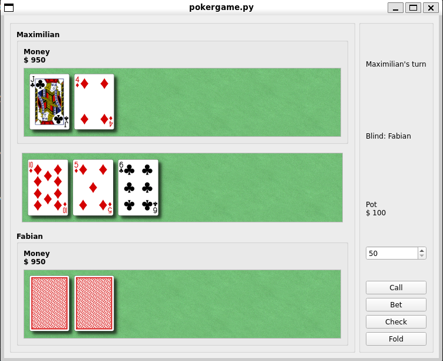

# 2-player Texas Hold'em
A simple 2-player Texas Hold'em poker game built with PyQt5. The game starts with a graphical interface where players input their names, starting money, and blind amount. After setting up, a game window displays player cards, the pot, and action buttons for betting, calling, checking, and folding. The game follows the standard Texas Hold'em rules and offers real-time updates during gameplay.



## Installation
1. Clone the repository
```bash
 git clone https://github.com/MaximilianSalen/Python-Texas-holdem-game.git
```

2. Install dependencies
```bash
 pip install -r requirements.txt
```

## Usage
To run the game, use the following command:
```bash
 python pokergame.py
```

Enter the names of the players on command line, followed by the amount of money each player is given and the blind amount.

To run tests, use the following command:
```bash
pytest
```


Enjoy!

## Future Improvements
- 2 second countdown after ending a turn to not reveal cards to opponent.